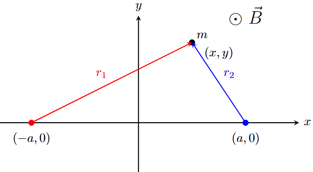
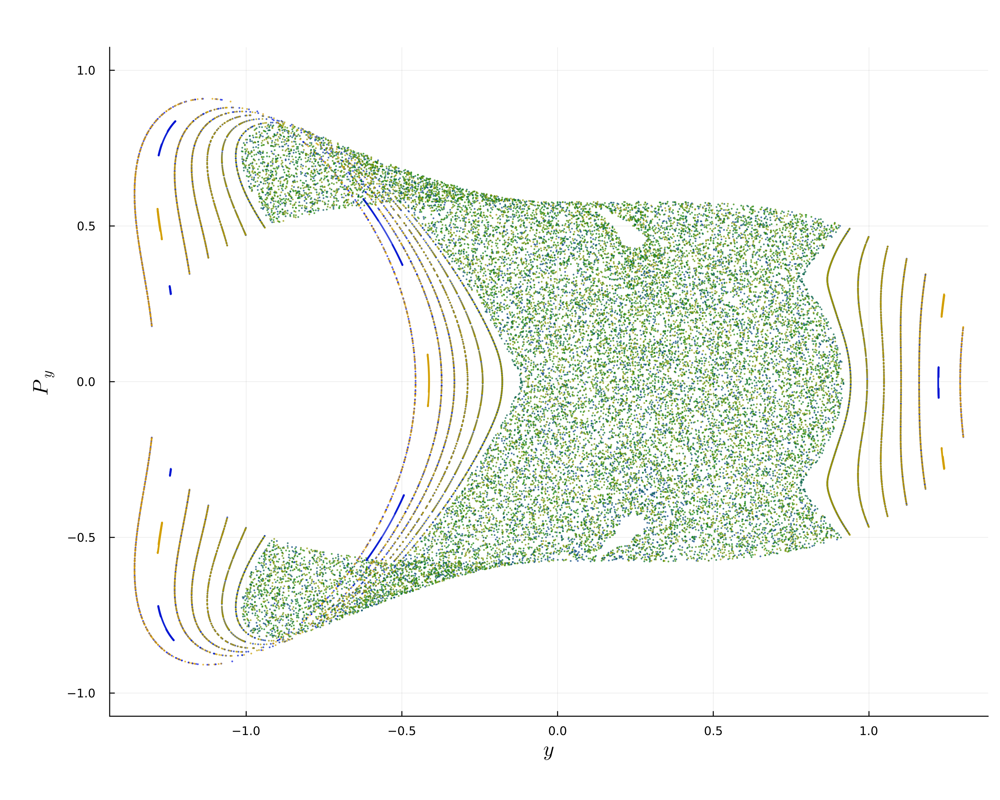
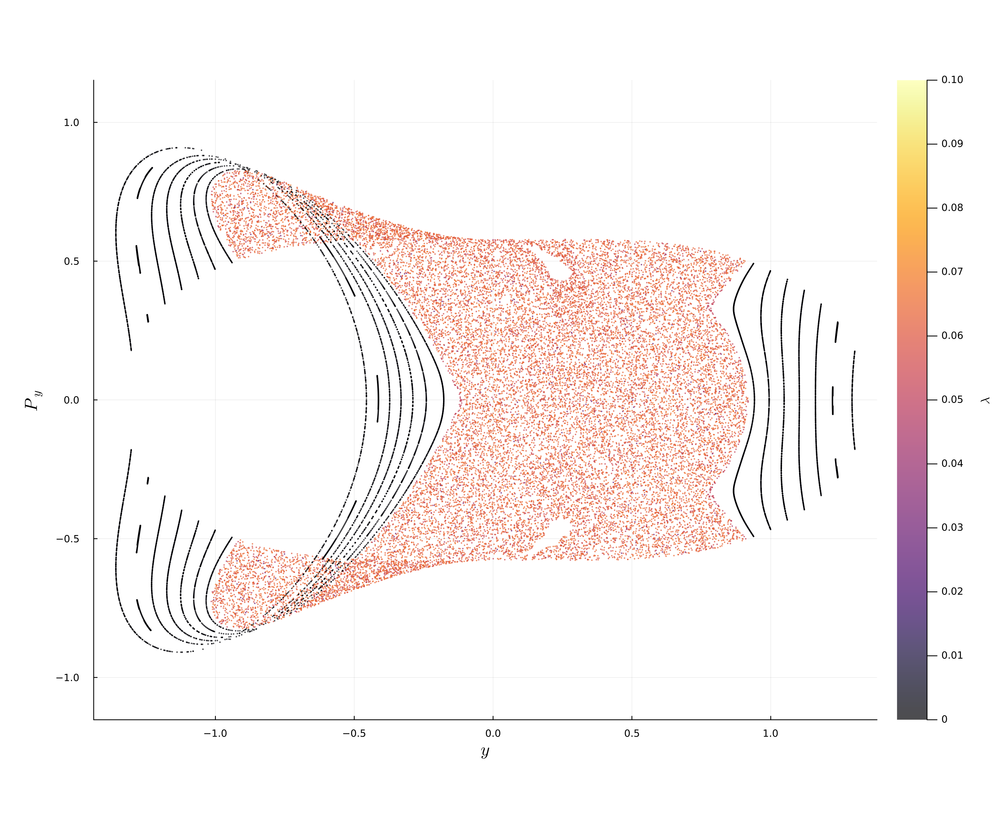

# ChaosTools
Lyapunov Exponents and Poincaré Section for 3-bodies problem with EM interactions
## 3-bodies problem on the plane
We make an aproximation in the analysis of the system with two fixed centers.

## Lyapunov Exponent & Poincaré sections example

The advantage of using these tools is the identification of quasi-periodic orbits and chaotic orbits, because the Lyapunov exponent quantifies the sensitivity of the trajectories.