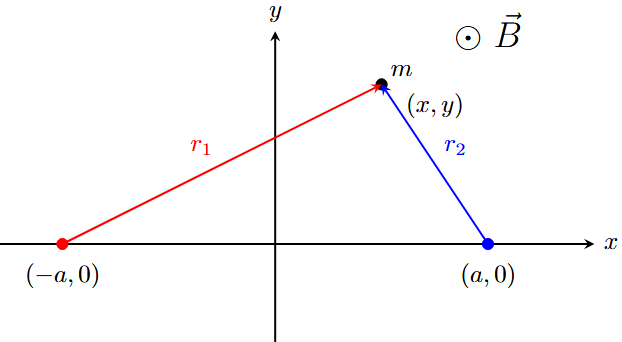

# ChaosTools
Lyapunov Exponents and Poincaré Section for 3-bodies problem with EM interactions
## 3-bodies problem on the plane
We make an aproximation in the analysis of the system with two fixed centers.

